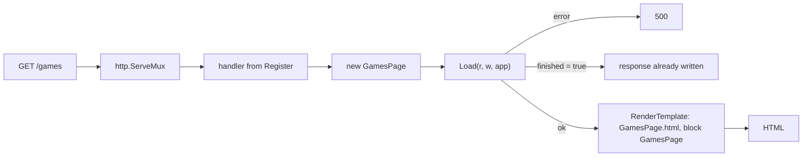

goapplib is a fairly thin layer over Go's standard library. A page is a Go type, routing is an `http.ServeMux`, and rendering is Go's `html/template` through [templar](https://github.com/panyam/templar), which adds includes, namespaces and template inheritance. There's no framework runtime between your handler and `net/http`, so anything that works with a `ServeMux` (middleware, `httptest`, other handlers on the same mux) works with goapplib.

## What it's built on

- **The standard library.** Pages register on an `*http.ServeMux` and each one is an `http.Handler`.
- **Mixins.** A page embeds the behaviors it needs (`BasePage`, `WithPagination`, `WithFiltering`, `WithAuth`, `WithHtmx`) and gets their fields.
- **Template inheritance.** goapplib's layouts are templar templates, and a page's template extends them rather than copying them.
- **Progressive enhancement.** Pages are plain HTML from the server. htmx can swap fragments of them, and islands of client code can mount into them, but neither is required.
- **Nothing implicit.** Every route is registered by hand, and a page's data comes from its own `Load`.

## A request, start to finish



`goapplib.Register[*GamesPage](app, mux, "/games")` puts a handler on the mux. For each request, that handler makes a fresh `GamesPage`, so pages never share state between requests, and calls its `Load`. If `Load` returns an error, the response is a 500 with the error's text. A `true` second value means `Load` has written the response itself (a redirect, a JSON answer), so nothing renders. Otherwise the handler renders the template named after the type, with the page as its data.

## The app and its context

`goapplib.App[AC]` is created once at startup and shared by every page:

```go
templates := goapplib.SetupTemplates("./templates", goapplibTemplates)
app := goapplib.NewApp(site, templates)
```

`AC` is your own type, the app context, and `app.Context` is the value you passed in. It's where the things every page needs go: service clients, configuration, an auth provider. A page reaches them in `Load` as `app.Context.Whatever`, which keeps pages free of globals and makes them easy to test with a context built for the test.

`app.Templates` is the templar template group. `SetupTemplates` builds one that looks in each folder you give it, in order, so your own templates come first and override goapplib's, and adds goapplib's template functions (`goapplib.DefaultFuncMap()`). To render some other way, set `app.RenderTemplateFunc`.

## Loaders

A page's `Load` has the same shape as the `Loader[AC]` interface:

```go
Load(r *http.Request, w http.ResponseWriter, app *goapplib.App[AC]) (err error, finished bool)
```

`goapplib.LoadAll(r, w, app, loaders...)` runs several in order and stops at the first one that fails or finishes, which suits a page assembled from reusable pieces. `goapplib.LoaderFunc[AC]` turns a function into a loader, and `goapplib.AuthLoader(&p.WithAuth, provider)` is one, for auth.

One catch, as of v0.6.9. goapplib's own mixins declare `Load(r, w, vc any)`, which doesn't match `Loader[AC]`, so `LoadAll` can't take them, though older examples show it doing so. Call a mixin's `Load` directly instead, as in `p.WithPagination.Load(r, w, app)`. We found this while writing these pages, against a compiled example, and fixing it is [#107](https://github.com/panyam/goapplib/issues/107).

## Where next

[Getting started]({{.Site.PathPrefix}}/guide/getting-started/) builds a one-page app. [Island pages]({{.Site.PathPrefix}}/guide/islands/) adds client code to a page, and [Go handlers in a Web Worker]({{.Site.PathPrefix}}/guide/wasmhost/) runs an app's Go in the browser.
